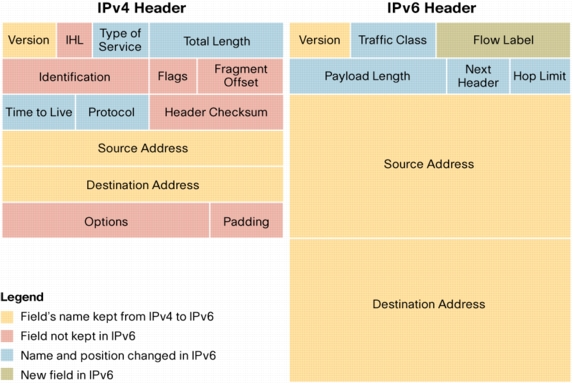

# Network connection basics, parts 4-5 (2019/07/17)

## Tunneling protocol
Tunneling protocol is a communications protocol that allows for the movement of data from one private network to another over the Internet as if they are parts of one private network. It is possible because of encapsilation process which involves repackaging and encryption, so the nature of traffic that run through the tunnel couldn't be defined. A tunneling protocol may allow a foreign protocol to run over a network that does not support that particular protocol, such as running IPv6 over IPv4. Tunneling could also be used to "sneak through" a firewall, using a protocol that the firewall would normally block, but "wrapped" inside a protocol that the firewall does not block, such as HTTP. The examples of tunneling protocols are SSH and VPN (with IPsec). Proxy server could be used for tunneling. Even I2P is built on HTTP tunnels.

## Proxy server

### Definition
Proxy server is a server that acts as an intermediary for requests from clients seeking resources from other servers. A client connects to the proxy server, requesting some service and the proxy server evaluates the request. Proxies were invented to add structure and encapsulation to distributed systems. Proxy could be used as a firewall, logger, way to hide real IP address and bypass ISP restrictions. The most well-known proxy server is sqiud. Nginx could be used as a reverse proxy. Even Tor is just a net of specially configured proxies.

### Types
Division by purpose:
- tunneling proxy (gateway) – passes unmodified requests and responses
- forward proxy (open proxy) – an Internet-facing proxy used to retrieve data from a wide range of sources (in most cases anywhere on the Internet), if anonymous - hides the IP
- reverse proxy – an internal-facing proxy used as a front-end to control and protect access to a server on a private network, commonly performs load-balancing, authentication, decryption or caching
OR by supported protocols:
- HTTP – forwards HTTP requests which supports proxy by standard (only TCP, suffers from a problem of limited bandwidth - so called TCP meltdown)
- SOCKS – forwards any protocols, supports UDP, SOCKS5 allows authentication

## NAT

### Definition
Network Address Translation – allows to connect the Internet from private network through one or multiple public IP addresses. Intended to temporary solve the problem of lack of public IPv4 addresses. Gateway proxy is a better solution then NAT, but NAT is easyer to configure. When IPv6 will replace IPv4 both NAT and gateway proxies will become useless. The main problem of NAT is a limited amount of users connections because the range of ports is limited to 65535, so the amount of parallel connections to the same website through the NAT is limited by this number (NAT behind NAT could be used as a solutin). When NAT is used, switch receives packages from local network, adds the local ip and port to the NAT table, changes local IP to public IP, local port to some different port and sends the package. When package is received, NAT looks through the table to find which local IP and port corresponds to the switch port the package came to, replaces the destination IP and port and forwards the package to the local user. Thus NAT could be used as a kind of firewall. Another problem is that NAT table can easily overfull the RAM on cheap devices.

### Types
- static - one local IP is put in compliance with one public IP, all ports are forwarded
- dynamic - one local IP is dynamically put in compliance with one public IP from the list of available ones, all ports are forwarded to the outside, to forward ports to the inside statically port forwarding must be used 
- many to one (mostly used) - switch receives packages from local network, adds the local ip and port to the NAT table, changes local IP to public IP, local port to some different port and resends the package (so 192.168.1.10:22 and 192.168.1.20:22 would be replaced with 192.0.2.14:5432 and 192.0.2.14:5433 and then back when response will be received; packages addressed to different ports, not 5432 and 5433, will be dropped)
- port forwarding (mapping) - some port of public IP is forwarded to specified local IP:port

## IPv6
IPv6 is a successor of IPv4 protocol. Nowadays all public IPv4 addresses have been sold and most of them are currently in use. That's why the IPv4 containing 4,294,967,296 addresses is currently in process of replacing with IPv6 with 340,282,366,920,938,463,463,374,607,431,768,211,456 addresses. IPv6 will make routing tables smaller and routing faster (because if the IP addresses in the subnet are not consecutive, they should be listed in the routing table; the idea was that the initial bits of the IP address can mark where to redirect the packets without using additional tables, but this is only possible when the ip addresses are distributed as a consecutive blocks). IPv6 header is simpler then IPv4.

Time to Live (TTL) field is replaced by Hop Limit (each hop decrements the value of this field, when it turns into 0 the packet is dropped and ICMP message is sent that packet was not delivered). Loopback IP changed from 127.0.0.1 to ::1. Private IP range goes from FC00::/7 till FDFF::/7. IPv6 subnet 2001:0DB8::/32 is reserved for documentation purposes (192.0.2.0/24 is reserved for documentation in IPv4).

## Sources
- [Туннелирование (компьютерные сети)](https://ru.wikipedia.org/wiki/Туннелирование_(компьютерные_сети))
- [Прокси-сервер](https://ru.wikipedia.org/wiki/Прокси-сервер)
- [SOCKS](https://ru.m.wikipedia.org/wiki/SOCKS)
- [Сети для самых маленьких. Часть четвертая. STP](https://linkmeup.ru/blog/15.html)
- [Сети для самых маленьких. Часть пятая. ACL и NAT](https://linkmeup.ru/blog/16.html)
- [Мысли вслух про IPv6, или почему нас не спасет NAT](https://habr.com/ru/post/127094/)
- [IPV6 – это весело. Часть 1](https://habr.com/ru/post/253803/)
